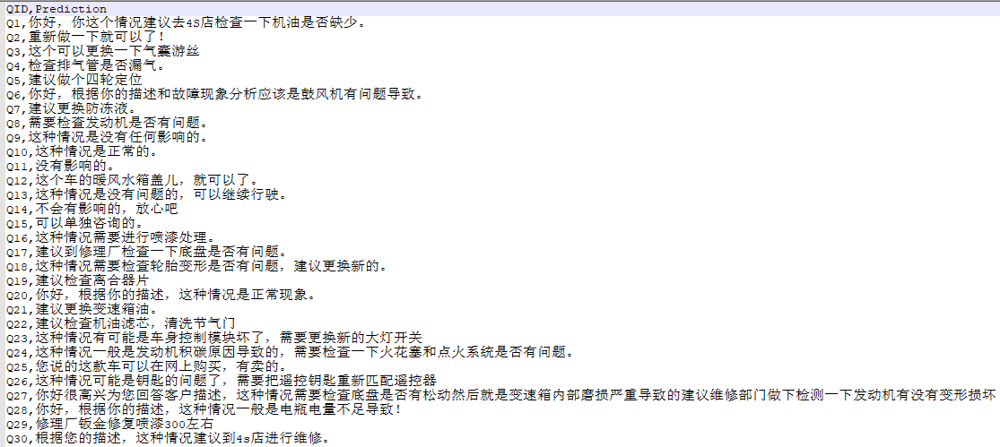

# 问答摘要与推理-基于Seq2Seq+Attention+PGN(生成式摘要)

## 简介
该项目为百度AI-Studio的竞赛项目，竞赛网址:

https://aistudio.baidu.com/aistudio/competition/detail/3

要求使用汽车大师提供的11万条技师与用户的多轮对话与诊断建议报告数据建立模型，基于对话文本、用户问题、车型与车系，输出包含摘要与推断的报告文本，考验模型的归纳总结与推断能力。

## 环境

  * Tensorflow-gpu = 2.0.0
  * GTX1080

## 结构说明
1. Word2vec_Gensim文件夹:实现对官方数据集的预处理，并使用Gensim来训练字词的Word2Vec.并将结果保存

2. Abstract_Extraction_Seq2Seq-Singel-Layer文件夹:

   1）搭建Seq2Seq+Attention模型来训练数据，并对官方数据进行预测

   2）测试阶段分别使用greedy search和beam search来实现，使用beam search时对Batch数据做了拼接操作，以提升预测速度

   3）针对生成式摘要存在的文本重复的问题，对生成的结果进行Top-k采样，融合beam search，再加入惩罚重复，有效解决生成摘要重复的问题

3. Abstract_Extraction_Seq2Seq-PGN文件夹:针对模型中存在的OOV问题，使用PGN网络来解决相关问题

## 生成结果

## 后续工作:

1）使用BertSUM实现抽取式的摘要提取，并进行结果对比

2）等。。。